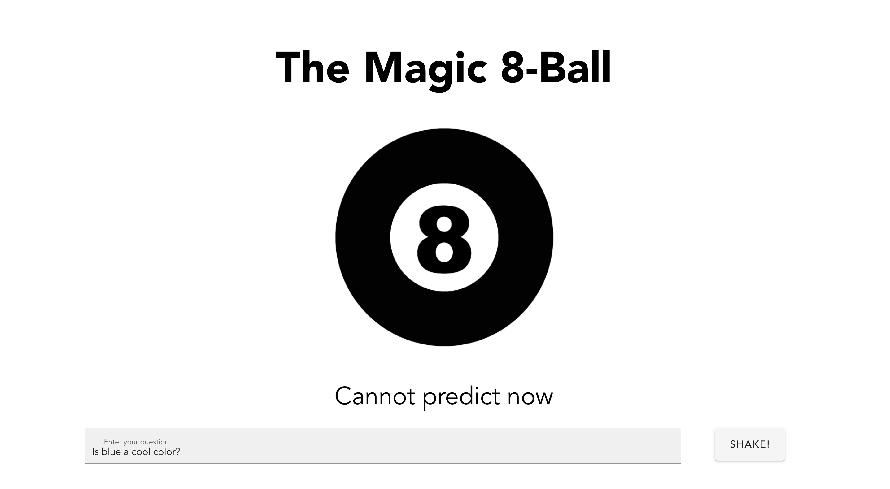
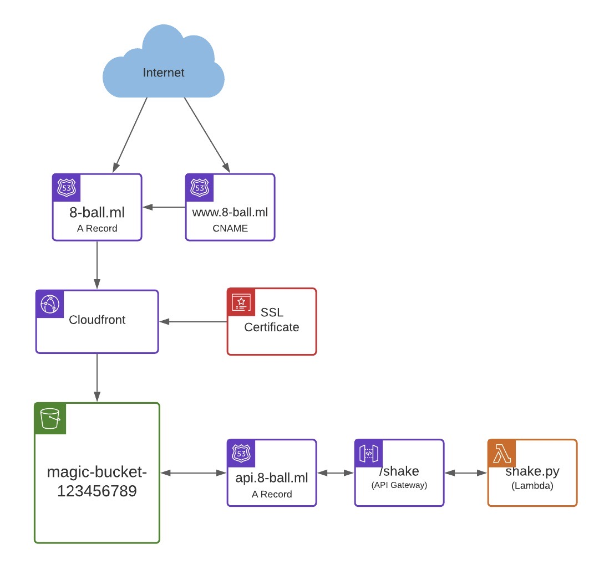

# Magic 8-Ball Web App

### Created by Jordan Ricks

## Description
This is a VueJS magic 8-ball web application hosted in an AWS S3 bucket. You can check it out yourself by visiting [8-ball.ml](https://www.8-ball.ml).

I origianally created this project as a way to teach others about AWS serverless technology such as API Gateway, S3, and Lambda. It served as a simple and effective begginer project. Since then, I have recreated the project in Terraform (IAC) and configured the website to be fully public facing with cloudfront.

## Technologies Used
- VueJS
- NodeJS
- AWS S3
- AWS API Gateway
- AWS Route 53
- AWS Certificate Manager
- AWS Lambda
- AWS Cloudfront
- AWS IAM
- Python
- Terraform
- Github Actions

## How it Works

When somebody types "8-ball.ml" into their browser the DNS returns the address of Cloudfront. Cloudfront attaches the SSL Certificate to the website and serves the website through the S3 bucket. When the "Shake" button is pushed, an http post request is sent to API Gateway, which forwards the request directly to our lambda. The lambda selects a random response from a list of responses and passes it back through API Gateway to our website. VueJS will dynamically update the webpage to display the answer.

## Lessons Learned
When I first started this project I did not realize all that went into hosting a public website. I started with a minimum viable product that ran on a local server. Over time I expanded the functionality of the project. 
## Setup
So, you want to set up your very own magic 8-ball website? Well, your in luck! Below you will find a step-by-step guide to do just that! I've taken out a lot of the tedious work, and best of all it only costs about 50¢ per month!

### 1. Create an AWS account
### 2. Get domain name
### 3. Create a hosted zone
### 4. Create a user for GitHub Actions
### 5. Set up your repo
### 6. Lets change some things
### 7. Deploy!

Ask the 8-ball a question and push shake. You should recieve an answer within a second or two.

 
 

## Conclusion

Enjoy making decisions with complete confidence with your new found magical descion making device!

## Resources
[FreeNom.com](https://freenom.com) - register a domain name for free for a year